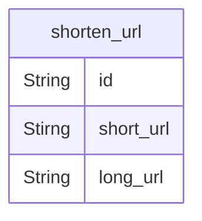
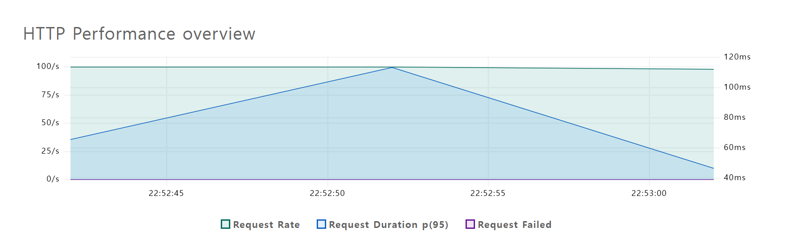
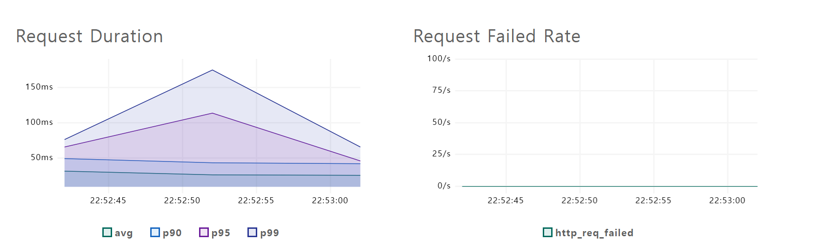
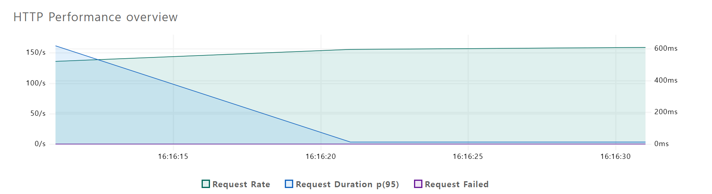
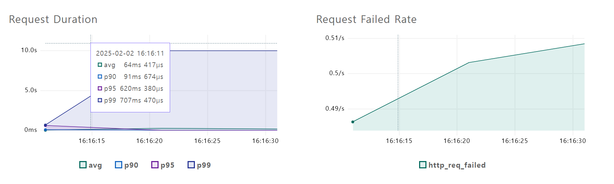
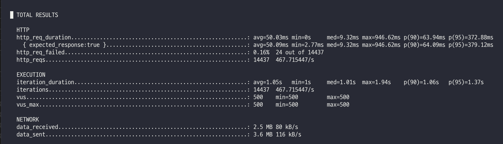
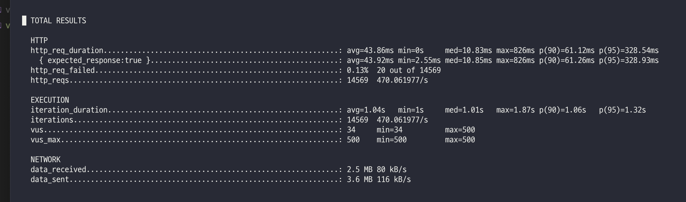
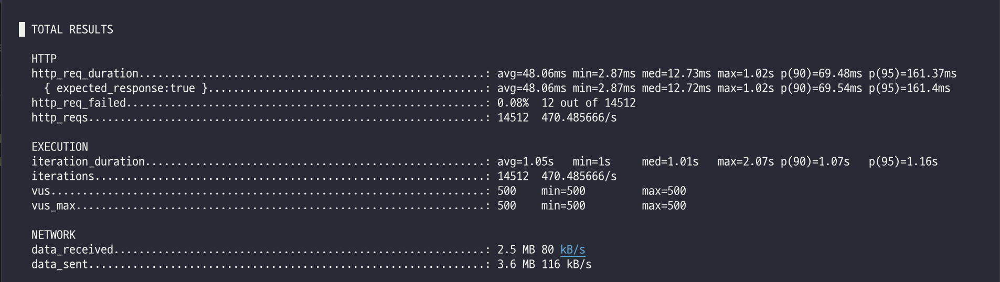
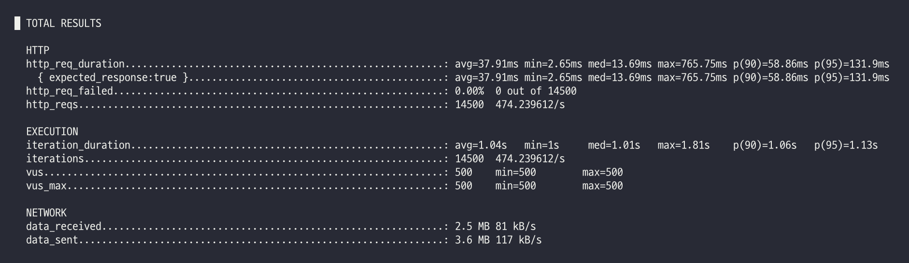

# URL 단축기

## 요구 사항

### 기본 기능

1. URL 단축 : 주어진 긴 URL을 훨씬 짧게 줄인다.
2. URL redirection : 축약된 url로 http 요청이 오면 원래 url로 안내한다.
3. 높은 규모 확장성 그리고 장애 감내가 요구된다.

### 계략적 추정

1. 쓰기 연산 : 매일 1억 개의 단축 url 생성
2. 초당 쓰기 연산 : 1억/24/3600 = 1160
3. 읽기 연산 : 읽기 연산과 쓰기 연산 비율은 10:1이라고 하자. 그 경우 읽기 연산은 초당 11,600회 발생한다.
4. URL 단축 서비스를 10년간 운영한다고 가정하면 1억 / 365 / 10 = 3650억개의 레코드를 보관해야 한다.
5. 축약 전 url의 평균 길이를 100이라고 하자. 따라서 10년 동안 필요한 저장 용ㅇ량은 3650억 * 100바이트 = 36.5TB 이다.

### API endpoint

1. url 단축용 endpoint : 새 단축 url 생성

```
POST /api/v1/data/shorten
- request : {longUrl : String}
- response : 단축 url
```

2. url redirect endpoint : 단축 url에 대해서 http요청이 오면 원래 url로 보내주기 위한 용도의 endpoint

```
GET /api/v1/{shortUrl}
- response : HTTP redirection 목적지가 될 원래 url
```

### ERD



## STEP1
처음은 가장 단순한 아키텍쳐인 웹 서버와 RDBMS로 시작한다.
RDBMS로는 가장 인기많은 벤더 중 하나인 MySQL을 골랐다.


### average load test
- hikari 설정
  - maximum-pool-size: 20
  - conection-timeout: 5000
  - max-lifetime: 50000
  - idle-timeout: 50000

- k6 설정
  - vus: 100
  - duration: 30s


첫번째로 쓰기 작업인 `/data/shorten` API에 대해서 부하 테스트를 실행 하였다. 





두번째로 읽기 작업인 `/{shortUrl}` API에 대해서 부하 테스트를 실행 하였다.





결과: db connection pool size를 20으로 설정했음에도 100명의 동시 접속자의 쓰기/읽기 작업이 가능한다는 것을 알았다. connectoin-pool-size보다 동시 접속자 수가 많더라도 쓰기/읽기 성능이 빠르면 pool size를 동시 접속자 수만큼 늘이지 않아도 충분히 처리할 수 있다는 점을 알 수 있다.

### stress test
- hikari 설정
  - maximum-pool-size: 20
  - conection-timeout: 5000
  - max-lifetime: 50000
  - idle-timeout: 50000

- tomcat 설정
  - thread.max: 200 # thread pool에서 아용할 최대 스레드 갯수
  - thread.min-spare: 10 # thread pool에서 최소한으로 유지할 스레드 갯수
  - accept-count: 100 # max-connections 이상의 요청이 들어왔을 때 사용하는 요청 대기열 queue의 사이즈
  - max-connections: 8192 # 동시에 처리할 수 있는 최대 connection의 갯수
  - connection-timeout: 60000

- k6 설정
  - vus: 500



결과: 0.16%의 http request가 실패 한 것을 확인 하였습니다. 실패율을 0%로 맞추기 위해 thread.max를 vu 갯수와 동일한 500으로 조정하고 다시 테스트를 수행 하였습니다.

- hikari 설정
  - maximum-pool-size: 20
  - conection-timeout: 5000
  - max-lifetime: 50000
  - idle-timeout: 50000

- tomcat 설정
  - thread.max: 500
  - thread.min-spare: 10
  - accept-count: 100 
  - max-connections: 8192 
  - connection-timeout: 60000

- k6 설정
  - vus: 500



결과: 여전히 실패한 http request가 있어서(0.13%) 로그를 확인 해보니 HikariPool에서 connection pool이 모자라서 waiting하는것이 보여서 hikari.maximum-pool-size를 닐려서 다시 테스트 수행하였습니다.

- hikari 설정
  - maximum-pool-size: 50
  - conection-timeout: 5000
  - max-lifetime: 50000
  - idle-timeout: 50000

- tomcat 설정
  - thread.max: 500 
  - thread.min-spare: 10 
  - accept-count: 100 
  - max-connections: 8192 
  - connection-timeout: 60000

- k6 설정
  - vus: 500



결과: 여전히 request fail이 있지만 실패율이 0.08%로 약 38% 줄어든것을 확인 할 수 있었다.


- hikari 설정
  - maximum-pool-size: 60
  - conection-timeout: 5000
  - max-lifetime: 50000
  - idle-timeout: 50000

- tomcat 설정
  - thread.max: 500 
  - thread.min-spare: 10
  - accept-count: 100 
  - max-connections: 8192 
  - connection-timeout: 60000

- k6 설정
  - vus: 500

  

  결과: http request 실패율이 0%가 되었고, TPS = 474로 나온 것을 확인하였다.