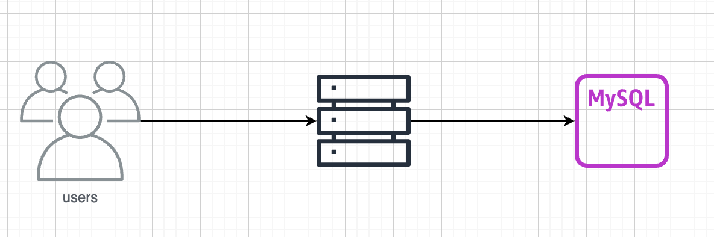

# URL 단축기

## 요구 사항

### 기본 기능

1. URL 단축 : 주어진 긴 URL을 훨씬 짧게 줄인다.
2. URL redirection : 축약된 url로 http 요청이 오면 원래 url로 안내한다.
3. 높은 규모 확장성 그리고 장애 감내가 요구된다.

### 계략적 추정

1. 쓰기 연산 : 매일 1억 개의 단축 url 생성
2. 초당 쓰기 연산 : 1억/24/3600 = 1160
3. 읽기 연산 : 읽기 연산과 쓰기 연산 비율은 10:1이라고 하자. 그 경우 읽기 연산은 초당 11,600회 발생한다.
4. URL 단축 서비스를 10년간 운영한다고 가정하면 1억 / 365 / 10 = 3650억개의 레코드를 보관해야 한다.
5. 축약 전 url의 평균 길이를 100이라고 하자. 따라서 10년 동안 필요한 저장 용ㅇ량은 3650억 * 100바이트 = 36.5TB 이다.

### API endpoint

1. url 단축용 endpoint : 새 단축 url 생성

```
POST /api/v1/data/shorten
- request : {longUrl : String}
- response : 단축 url
```

2. url redirect endpoint : 단축 url에 대해서 http요청이 오면 원래 url로 보내주기 위한 용도의 endpoint

```
GET /api/v1/{shortUrl}
- response : HTTP redirection 목적지가 될 원래 url
```

### ERD


### STEP1
처음은 가장 단순한 아키텍쳐인 웹 서버와 RDBMS로 시작한다.
RDBMS로는 가장 인기많은 벤더 중 하나인 MySQL을 골랐다.


